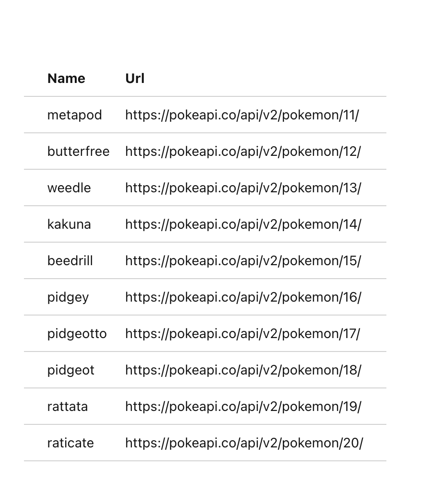
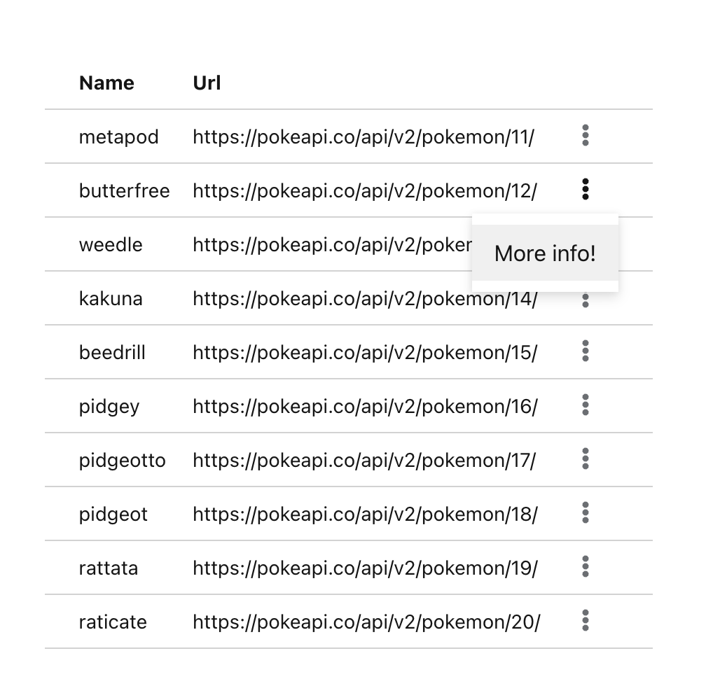
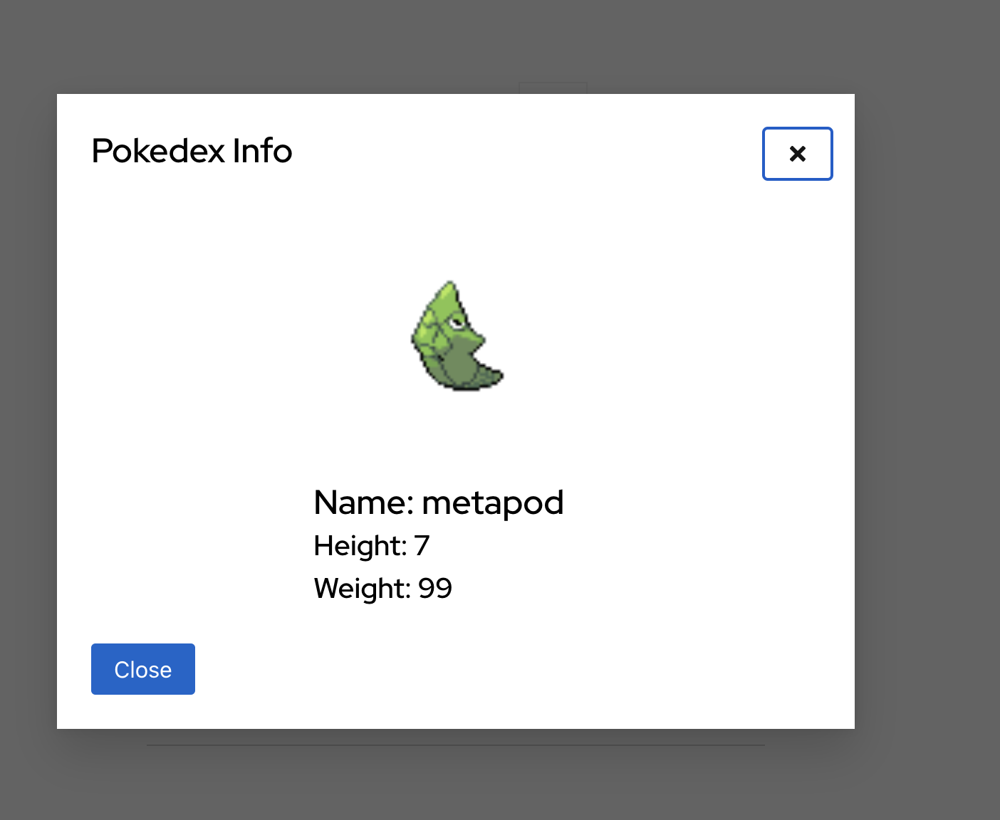
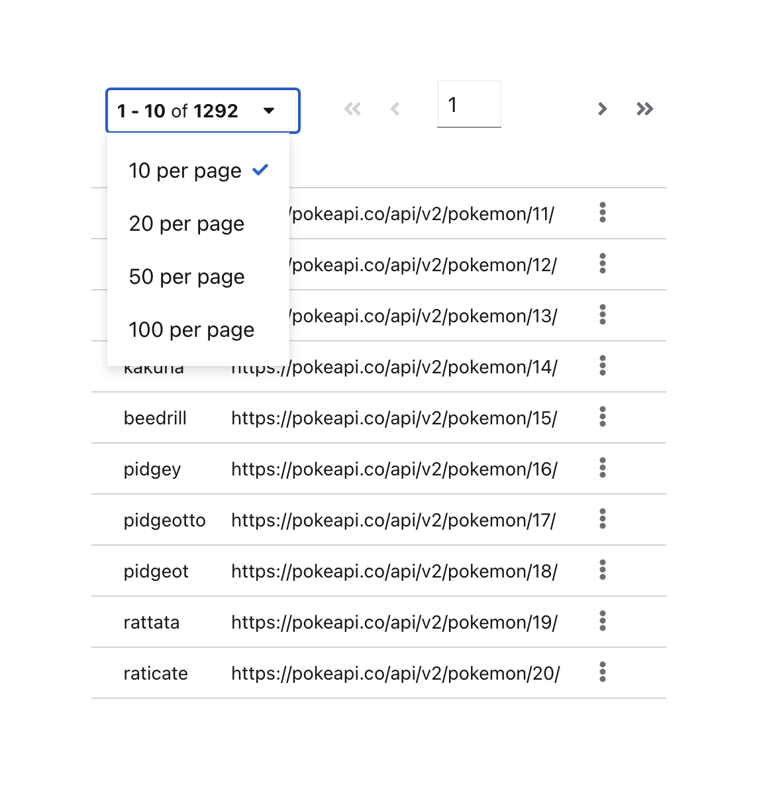

# React/Patternfly/Typescript learning App!

This repository is meant to be cloned in order to learn the basics of React/Patternfly/Typescript and API calling.
Although there are tasks to complete below, it is recommended to use this as a test bed for learning these technologies.
Feel free too experiment with the given API's and technologies as you progress through the below tasks.

## Documentation

- [Typescript, in 5 minutes](https://www.typescriptlang.org/docs/handbook/typescript-in-5-minutes.html)
- [Installing React with typescript](https://create-react-app.dev/docs/adding-typescript/#installation)
- [How to make fetch calls](https://www.freecodecamp.org/news/how-to-make-api-calls-with-fetch/)
- [Making fetch calls with typescript](https://dev.to/simonireilly/fetch-with-typescript-for-better-http-api-clients-2d71)
- [Patternfly - Getting started](https://www.patternfly.org/get-started/develop)
- [Patternfly - Using a table](https://www.patternfly.org/components/table/#actions)
- [Patternfly - Using a modal](https://www.patternfly.org/components/modal#basic-modals)
- [Patternfly - Using the pagination component](https://www.patternfly.org/components/pagination)
- [PokéAPI documentation](https://pokeapi.co/)

## Initial setup

1. First [fork](https://github.com/content-services/react-patternfly-typescript-learning/fork) this repository then [clone](https://docs.github.com/en/repositories/creating-and-managing-repositories/cloning-a-repository) **your** newly created fork locally.

2. Now within your locally cloned directory, we need to install React/typescript.

   ###### If you changed your fork's name from "react-patternfly-typescript-learning" you'll need to change the below command.

   ```
   npx create-react-app ../   react-patternfly-typescript-learning    --template typescript
   ```

   Get help from [this](https://create-react-app.dev/docs/adding-typescript/#installation) documentation if needed.

3. Now install Patternfly (both core and table) you can read why [here](https://www.patternfly.org/get-started/develop#install-and-configure-patternfly-react)

   ```
   npm install @patternfly/react-core   @patternfly/patternfly  @patternfly/react-table  --save
   ```

4. Start the application, to make sure it's working.

   ```
   npm start
   ```

   You should now have a working React application, with typescript installed. Woot!

5. Now let's clear out the default content

   - Go to your `src/App.tsx` file and replaced it with the following:

   ```
   import './App.css';
   import '@patternfly/patternfly/patternfly.css'

   function App() {
       return (
           <div className="App">
               <header className="App-header">
                   {/* This is where you will    write your code */}
               </header>
           </div>
       );
   }

   export default App;
   ```

   You are almost ready to start on your tasks!

6. You should now decide on a folder structure and set up your folders for your project (where you are going to put your api functions, components, stage management).

   _You will at minimum need a folder for your API calls._

   ###### I recommend reading [this](https://www.robinwieruch.de/react-folder-structure/) and [this](https://blog.webdevsimplified.com/2022-07/react-folder-structure/) to get an idea what is regularly used.

## Tasks

<b>DO</b> spend some time reading the above [documentation](README.md#L7), the required information to complete the tasks below are contained within.

---

1. Using the PokéAPI and Patternfly, create a table that will fetch a list of only 10 pokemon.

   - [Read](https://developer.digitalchalk.com/document/rest-api-v5/limit-and-offset/) about limit/offset and how they work with list API's.
   - [Read](https://pokeapi.co/docs/v2#resource-listspagination-section) about how the PokéAPI's list endpoint works.
   - You can test your API calls [here](https://pokeapi.co/)

   - Fetch against the following api: `https://pokeapi.co/api/v2/pokemon/`
   - The table should have two columns, each pokemons' `name` and `url` for more information.
   - Optionally - [Consider](https://www.patternfly.org/layouts/about) utilizing patternfly's layout components to center and organize your view.

---



---

2. Using patternfly and the PokéAPI, create a kebab for each row in the table (as seen [here](https://www.patternfly.org/components/table#actions)). This kebab will have 1 menu item named `More Info`. Upon clicking the `More info` button, a modal will appear, containing more information about the selected pokemon.

   - This modal must include:
     1. The name of the pokemon
     2. An image of the pokemon
     3. The weight of the pokemon
     4. The height of the pokemon
   - Ensure the close button works.

---




---

3. Add pagination to the table with the patternfly [Pagination](https://www.patternfly.org/components/pagination) component found here.

   - Utilize the `limit`/`offset` values you learned about above, and the `count` variable returned from the List API you've created.
   - Save and update the "perPage" and page values in state for the pagination component.
   - You should be able to click forward and back through

---



---

That's all for now!
